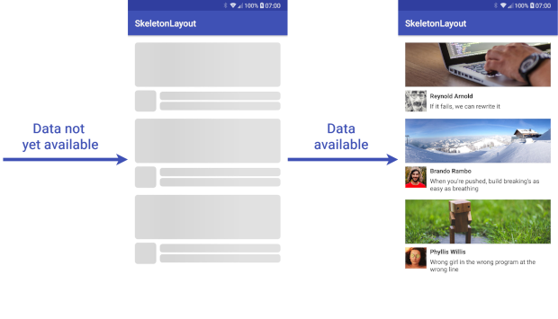

# Android Ping App

An Android application that monitors SMS messages and maintains a server connection through regular ping requests, running seamlessly in the background even when the device is locked.



## Features

- Enter and manage multiple phone numbers (comma-separated)
- Send periodic ping requests to the server every 10 seconds
- Monitor and forward incoming SMS messages to the server
- Run continuously in the background with a foreground service
- View the last 10 requests history (both ping and SMS)
- Resilient operation even when device is locked

## Technical Details

### Ping Requests

The app sends a POST request to the server every 10 seconds with the following structure:
```json
{
  "type": "ping",
  "phoneNumber": "1234567890,123456788" // User-entered phone numbers
}
```

### SMS Forwarding

When an SMS is received, the app forwards it to the server with the following structure:
```json
{
  "type": "sms",
  "sender": "+351924874745",
  "recipient": "Unknown",
  "body": "yo",
  "pdu": "7,-111,35,48,16,33,0,104,36,12,-111,83,-111,66,120,116,84,0,1,82,48,113,17,116,-123,0,2,-7,55",
  "phoneNumber": "..." // User-entered phone numbers
}
```

## Required Permissions

- `RECEIVE_SMS`: To receive SMS messages
- `READ_SMS`: To read SMS content
- `INTERNET`: To communicate with the server
- `FOREGROUND_SERVICE`: To run in the background
- `POST_NOTIFICATIONS`: To show a notification for the foreground service

## Getting Started

### Prerequisites

- Android Studio
- Android SDK 21+
- Java 8+

### Installation

1. Clone this repository
```bash
git clone https://github.com/yourusername/android-ping-app.git
```

2. Open the project in Android Studio

3. Build and run the application on your device or emulator

## Usage

1. Launch the app
2. Enter the phone numbers in the text field (comma-separated for multiple numbers)
3. Click "Save" to store the phone numbers
4. The app will automatically start sending ping requests and monitoring SMS messages
5. Use the floating action button to start/stop the service
6. View the history tab to see the last 10 requests made by the app

## Privacy Policy

For information about how the app handles data, please see our [Privacy Policy](PRIVACY_POLICY.md).

## License

This project is licensed under the Apache License 2.0 - see the [LICENSE](LICENSE) file for details.

## Changelog

For a detailed list of changes and version history, see the [CHANGELOG](CHANGELOG.md) file. 